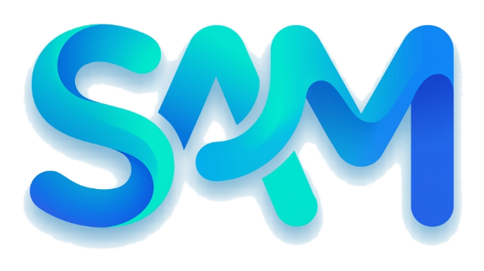

<p align="center">
  
</p>

<h1 align="center">Sam's Progress Tracker</h1>
<p align="center">
  <b>LiquidGlassStudy — Premium Kotlin Study Tracker</b><br/>
  A native Android study tracker built with <b>Kotlin</b>, <b>Jetpack Compose</b>, <b>Material 3</b>, and <b>Supabase</b>.
</p>

<p align="center">
  
  
  
  
  
</p>

---

## ✨ Overview

**Sam's Progress Tracker** is a native Android app designed as a **strict, smart, and scalable personal study system**.

It helps track:

- mock tests and attempts
- video learning progress
- revision work
- reading sessions
- mistakes and weak areas
- daily study tasks
- analytics and progress trends

The app is designed to feel:

- **smart**
- **accurate**
- **strict**
- **easy to use**
- **scalable**
- **professionally structured**

The goal is simple:

> Ask only the right questions, store the right data, and make every submission visible and useful later.

---

## 🚀 Key Highlights

- Native **Kotlin Android app**
- Built with **Jetpack Compose**
- **Material 3** UI with premium liquid-glass inspired visuals
- **Supabase** authentication + database integration
- **Recent Activity** with submitted-detail visibility
- **Mistake Book** with linked submission context
- **Smart Add** workflow
- **Progress analytics**, charts, and breakdowns
- Local storage + sync-friendly data flow
- Clean architecture using models, repositories, view model, and UI layers

---

## 🧭 Main Navigation

The app is organized into 5 core tabs:

### 1. Home
Your study command center.

Includes:
- focus score
- next best action
- quick actions
- recent result snapshot
- weak topic highlight
- timeline / quick overview

### 2. Today
Your daily study dashboard.

Includes:
- daily mission/task view
- today's active tasks
- checkboxes and completion workflow
- daily progress snapshot
- submit/update daily progress

### 3. Study
The structured study management section.

Includes:
- activity type cards
- catalog/source selection
- smart add flow
- search and filters
- recently used items
- favorite study items
- strict category-based submission forms

### 4. Mistakes
Your mistake review system.

Includes:
- mistake records
- linked source test/submission info
- review states like:
  - New
  - Reviewing
  - Fixed
- mistake details and context

### 5. Progress
Your visual analytics dashboard.

Includes:
- performance summaries
- type-wise analytics
- charts
- progress indicators
- study distribution data

---

## 🧠 Smart Add System

One of the key parts of this app is the **Smart Add** flow.

Instead of using one generic form for everything, the app understands what the user is adding and asks only the required fields.

### Home / Today `+`
The add button works like a **daily quick action launcher**.

Examples:
- Add study session
- Review mistakes
- Add revision
- Add mock attempt
- Add video progress
- Add reading progress
- Add quick note

### Study `+`
The add button works like a **structured study entry system**.

Examples:
- Mock / Test
- Video
- Revision
- Reading
- Practice / PYQ
- Custom / category-based item

Each flow can ask category-specific information, so the user never gets useless fields.

---

## 📊 Analytics & Tracking

The app is designed to turn raw study activity into meaningful progress insights.

Possible insights include:

- mock score trend
- accuracy trend
- study-time trend
- activity distribution
- correct vs wrong vs skipped breakdown
- mistake reason distribution
- subject-wise performance
- video progress
- revision progress

---

## 🗂️ Screenshots

> Place your screenshots inside a `screenshots/` folder in the project root using the exact file names below.

Recommended file names:

```text
screenshots/01-home.png
screenshots/02-today.png
screenshots/03-study.png
screenshots/04-mistakes.png
screenshots/05-progress.png
screenshots/06-how-to-submit.png
screenshots/07-what-submitted.png
screenshots/08-user-detail.png
screenshots/09-checkbox.png
